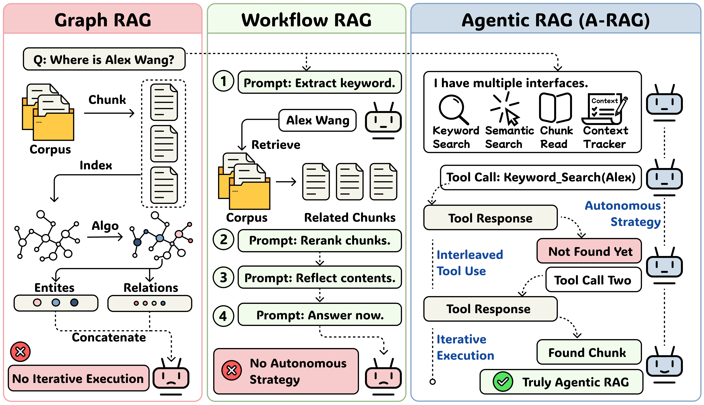
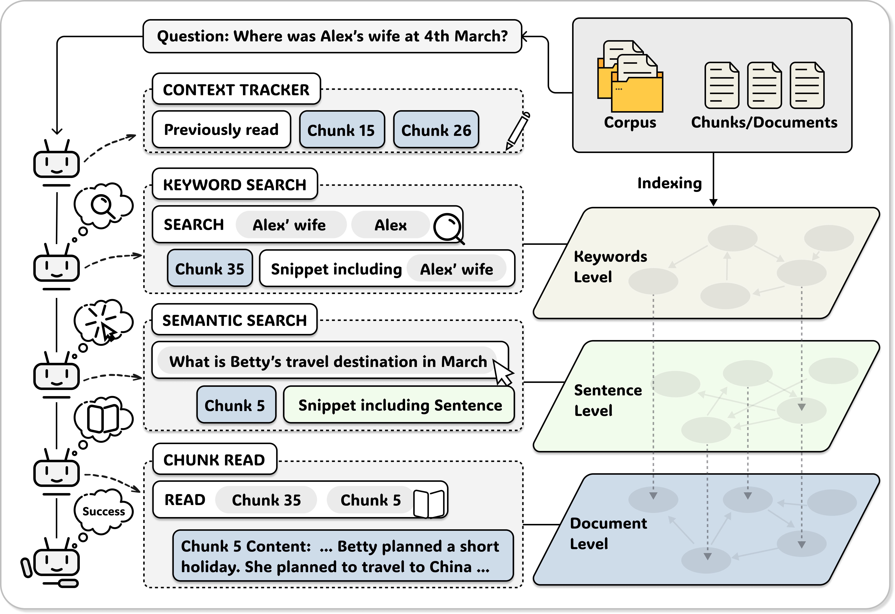

<div align="center">

# A-RAG: Agentic Retrieval-Augmented Generation with Memory Integration

<a href="https://arxiv.org/abs/2602.03442"></a>
<a href="https://agentresearchlab.org/agents/a-rag/index.html#home"></a>
<a href="https://huggingface.co/datasets/Ayanami0730/rag_test"></a>
<a href="https://opensource.org/licenses/MIT"></a>

**Empowering LLMs with Hierarchical Retrieval Tools and Memory Integration**

</div>

---

## 🚀 Quick Start (Verified)

### Step 1: Installation

```bash
# Clone the repository
git clone https://github.com/Ayanami0730/arag.git
cd arag

# Install dependencies (choose one)
uv sync --extra full              # Using uv (recommended)
# or
pip install -e ".[full]"          # Using pip

# Optional: Install uv if needed
curl -LsSf https://astral.sh/uv/install.sh | sh
```

**Required Python version**: 3.10+
**Dependencies**:
- Core: `requests`, `pyyaml`, `tiktoken`, `tqdm`, `numpy`
- Full: Adds `sentence-transformers`, `pandas`, `pyarrow` for embeddings and data processing

### Step 2: Download Datasets

```bash
# Download benchmark datasets from HuggingFace (7 datasets)
git clone https://huggingface.co/datasets/Ayanami0730/rag_test data --depth 1

# Clean up git files
rm -rf data/.git data/README.md

# Available datasets:
# - data/musique/           (Multi-hop question answering)
# - data/hotpotqa/          (Knowledge base QA)
# - data/2wikimultihop/     (Multi-wiki comparison)
# - data/medical/           (Medical domain)
# - data/novel/             (Fiction text)
```

Each dataset contains:
- `chunks.json` - Document chunks for retrieval
- `questions.json` - Test questions with references
- `index/` - Pre-built embedding index (optional)

### Step 3: Build Embedding Index (Optional)

```bash
# Build semantic search index for faster retrieval
# Uses Qwen3-Embedding-0.6B (lightweight but effective)
python scripts/build_index.py \
    --chunks data/musique/chunks.json \
    --output data/musique/index \
    --model Qwen/Qwen3-Embedding-0.6B \
    --device cuda:0  # or "cpu"

# Alternative: Use local model path
python scripts/build_index.py \
    --chunks data/musique/chunks.json \
    --output data/musique/index \
    --model /path/to/local/embedding/model \
    --device cuda:0
```

### Step 4: Configure LLM API

Set your LLM provider credentials via environment variables:

```bash
# OpenAI (default)
export ARAG_API_KEY="sk-..."
export ARAG_BASE_URL="https://api.openai.com/v1"
export ARAG_MODEL="gpt-4o-mini"

# Or Azure OpenAI
export ARAG_API_KEY="your-azure-key"
export ARAG_BASE_URL="https://your-instance.openai.azure.com"
export ARAG_MODEL="gpt-4"

# Or other OpenAI-compatible providers (Ollama, vLLM, etc.)
export ARAG_BASE_URL="http://localhost:8000/v1"
```

**Supported models** (see `src/arag/core/llm.py` for pricing):
- OpenAI: gpt-4o, gpt-4o-mini, gpt-4-turbo, o1, o3-mini
- Anthropic: claude-opus, claude-sonnet, claude-haiku
- Google: gemini-pro, gemini-flash
- Local/Custom: Any OpenAI-compatible API

### Step 5: Run ARAG Agent

#### **Option A: BaseAgent (Hierarchical Retrieval)**

Supports three retrieval tools: keyword search → semantic search → chunk reading

```bash
python scripts/batch_runner.py \
    --config configs/example.yaml \
    --questions data/musique/questions.json \
    --output results/musique \
    --limit 100 \
    --workers 5 \
    --agent-type base  # default
```

**Output**: `results/musique/predictions.jsonl` with tool call logs

#### **Option B: MemoryAgent (Re-MEMR1 Integration)**

Processes chunks sequentially with accumulated memory and TF-IDF recall

```bash
# Requires: scikit-learn
pip install scikit-learn

python scripts/batch_runner.py \
    --config configs/memory_example.yaml \
    --questions data/musique/questions.json \
    --output results/musique_memory \
    --limit 100 \
    --workers 5 \
    --agent-type memory
```

**Output**: Also includes memory state tracking in predictions

### Step 6: Evaluate Results

```bash
# Evaluate predictions against reference answers
python scripts/eval.py \
    --predictions results/musique/predictions.jsonl \
    --workers 5

# Outputs metrics (Exact Match, F1-Score, etc.)
```

---

## 📋 Configuration Files

### BaseAgent Configuration (`configs/example.yaml`)
```yaml
llm:
  temperature: 0.0              # Deterministic answers
  max_tokens: 16384
  reasoning_effort: "medium"    # For o1/o3 reasoning models

embedding:
  model: "Qwen/Qwen3-Embedding-0.6B"
  device: "cuda:0"
  batch_size: 16

agent:
  max_loops: 15                 # Max retrieval iterations
  max_token_budget: 128000      # Token limit for context

data:
  chunks_file: "data/chunks.json"
  index_dir: "data/index"
```

### MemoryAgent Configuration (`configs/memory_example.yaml`)
```yaml
# Same as above, plus memory settings via MemoryConfig class
memory:
  memory_size: 5000             # Memory token budget
  recall_examples: 3            # Examples recalled per chunk
  update_prompt: "<update>...</update>"
```

---

## ✅ Quick Start Verification Checklist

- [ ] Python 3.10+ installed
- [ ] Dependencies installed: `pip show sentence-transformers`
- [ ] Datasets downloaded: `ls data/musique/` shows chunks.json, questions.json
- [ ] API credentials configured: `echo $ARAG_API_KEY`
- [ ] Embedding index ready: `ls data/musique/index/sentence_index.pkl` (if using semantic search)
- [ ] Test run successful: `python scripts/batch_runner.py ... --limit 1`
- [ ] Results saved: `ls results/musique/predictions.jsonl`

---

## 📊 Supported Datasets

| Dataset | Type | Samples | Avg Hops | Status |
|---------|------|---------|----------|--------|
| MusiQue | Music info QA | 743 | 2-3 | ✅ Ready |
| HotpotQA | Knowledge QA | 5,600+ | 2+ | ✅ Ready |
| 2WikiMultiHop | Wikipedia comparison | 192 | 2-3 | ✅ Ready |
| Medical | Medical retrieval | 1,000+ | 1-2 | ✅ Ready |
| Novel | Fiction comprehension | 10,000+ | 1-3 | ✅ Ready |

---

## 🛠️ Troubleshooting

### **Issue: "ModuleNotFoundError: No module named 'sentence_transformers'"**
```bash
pip install sentence-transformers
```

### **Issue: CUDA out of memory**
```bash
# Reduce batch size in config
embedding:
  batch_size: 8  # Default is 16

# Or use CPU
embedding:
  device: "cpu"
```

### **Issue: API connection timeout**
```bash
# Check API credentials
echo $ARAG_API_KEY
echo $ARAG_BASE_URL

# Test connection
python -c "from arag import LLMClient; c = LLMClient(); print(c.model)"
```

### **Issue: Empty results**
```bash
# Enable verbose logging to see tool calls
python scripts/batch_runner.py ... --verbose

# Check if semantic index exists
ls data/musique/index/
# If missing, rebuild it:
python scripts/build_index.py --chunks data/musique/chunks.json --output data/musique/index
```

---

## 📝 Output Format

Both agents produce identical output format for fair comparison:

```json
{
  "question_id": "q1",
  "question": "What is...?",
  "answer": "The answer is...",
  "trajectory": [
    {
      "step": 1,
      "tool_name": "keyword_search",
      "tool_input": "search term",
      "tool_output": "retrieved chunks",
      "reasoning": "Why this tool?"
    }
  ],
  "total_cost": 0.042,
  "loops": 5,
  "tool_usage_summary": {
    "keyword_search": 2,
    "semantic_search": 1,
    "read_chunk": 3
  },
  "total_retrieved_tokens": 2048,
  "chunks_read_count": 3,
  "chunks_read_ids": ["chunk_123", "chunk_456"]
}
```

For MemoryAgent, additional fields:
```json
{
  "memory_state": {
    "final_memory": "Accumulated facts...",
    "history_size": 5
  }
}
```

---

## ✨ News

- **[Feb 2026]** 📄 Paper released on [arXiv](https://arxiv.org/abs/2602.03442)
- **[Feb 2026]** 🚀 Initial code and evaluation suite released

---

## 📖 Overview

Frontier language models have demonstrated strong reasoning and long-horizon tool-use capabilities. However, existing RAG systems fail to leverage these capabilities. They still rely on two paradigms:
1. **Graph RAG**: Designing an algorithm that retrieves passages in a single shot and concatenates them into the model's input
2. **Workflow RAG**: Predefining a workflow and prompting the model to execute it step-by-step

Neither paradigm allows the model to participate in retrieval decisions, preventing efficient scaling with model improvements.

### Three Principles of Agentic RAG

We identify three key principles that define true agentic autonomy:
- **Autonomous Strategy**: The agent dynamically chooses retrieval strategies based on task characteristics
- **Iterative Execution**: The agent supports multi-round execution, adapting based on intermediate results
- **Interleaved Tool Use**: The agent follows a ReAct-like action→observation→reasoning loop

<div align="center">


*Comparison of three RAG paradigms. Only A-RAG satisfies all three principles, making it a truly agentic framework.*
</div>

### Our Solution: A-RAG

**A-RAG** is an **A**gentic **RAG** framework that exposes **hierarchical retrieval interfaces** directly to the model. A-RAG provides three retrieval tools: `keyword_search`, `semantic_search`, and `chunk_read`, enabling the agent to adaptively search and retrieve information across multiple granularities.

<div align="center">


*Overview of A-RAG framework. The agent iteratively uses hierarchical retrieval tools to gather information from the corpus and autonomously decides when to provide the final answer.*
</div>

### Key Features

- 🔍 **Hierarchical Retrieval**: Keyword-level, sentence-level, and chunk-level information access
- 🤖 **True Agentic Autonomy**: Autonomous strategy, iterative execution, and interleaved tool use
- 📈 **Test-Time Scaling**: Performance improves with increased compute resources
- ⚡ **Context Efficient**: Achieves superior accuracy with comparable or fewer retrieved tokens

---

## 📊 Main Results

Results (%) of baselines and A-RAG on benchmark datasets in terms of **LLM-Evaluation Accuracy (LLM-Acc)** and **Contain-Match Accuracy (Cont-Acc)**. Best results are in **bold**, second best are <u>underlined</u>.

### GPT-4o-mini Backbone

| Method | MuSiQue |  | HotpotQA |  | 2Wiki |  | Med. | Novel |
|--------|:-------:|:----:|:--------:|:----:|:-----:|:----:|:----:|:-----:|
|        | LLM | Cont | LLM | Cont | LLM | Cont | LLM | LLM |
| **Vanilla Baselines** |||||||||
| Direct Answer | 18.3 | 13.9 | 45.4 | 40.7 | 30.3 | 49.7 | 68.6 | 45.3 |
| Naive RAG | 38.6 | 36.1 | 74.5 | <u>72.9</u> | 42.6 | 59.0 | 75.3 | 68.5 |
| **Graph-RAG & Workflow RAG** |||||||||
| GraphRAG | 26.4 | 20.8 | 33.2 | 33.3 | 18.4 | 47.2 | 51.3 | 28.8 |
| HippoRAG2 | 40.6 | 38.4 | **80.7** | 69.7 | **64.7** | **68.5** | 72.0 | <u>70.1</u> |
| LinearRAG | 34.8 | 26.3 | 72.0 | 60.5 | <u>62.9</u> | <u>62.3</u> | 53.1 | 45.4 |
| FaithfulRAG | 28.8 | 22.6 | 60.5 | 52.5 | 38.8 | 38.1 | 42.5 | 33.3 |
| MA-RAG | 34.1 | 27.4 | 60.6 | 54.4 | 51.0 | 53.4 | 62.3 | 44.5 |
| RAGentA | 32.2 | 29.9 | 63.0 | 62.4 | 27.7 | 50.3 | 67.7 | 61.3 |
| **A-RAG (Ours)** |||||||||
| A-RAG (Naive) | <u>43.8</u> | <u>38.5</u> | 76.6 | 70.7 | 52.3 | 62.4 | <u>79.0</u> | 70.0 |
| A-RAG (Full) | **46.1** | **39.6** | <u>77.1</u> | **74.0** | 60.2 | 63.7 | **79.4** | **72.7** |

### GPT-5-mini Backbone

| Method | MuSiQue |  | HotpotQA |  | 2Wiki |  | Med. | Novel |
|--------|:-------:|:----:|:--------:|:----:|:-----:|:----:|:----:|:-----:|
|        | LLM | Cont | LLM | Cont | LLM | Cont | LLM | LLM |
| **Vanilla Baselines** |||||||||
| Direct Answer | 35.8 | 26.5 | 63.6 | 53.5 | 51.3 | 54.0 | 90.5 | 45.1 |
| Naive RAG | 52.8 | 48.7 | 81.2 | 79.5 | 50.2 | 66.5 | 86.1 | 70.6 |
| **Graph-RAG & Workflow RAG** |||||||||
| GraphRAG | 48.3 | 39.1 | 82.5 | 74.9 | 66.5 | 70.7 | 87.3 | <u>77.1</u> |
| HippoRAG2 | 61.7 | 52.5 | 84.8 | 75.0 | 82.0 | 79.7 | 78.2 | 54.3 |
| LinearRAG | 62.4 | 51.8 | 86.2 | 77.6 | <u>87.2</u> | <u>84.8</u> | 79.2 | 54.7 |
| FaithfulRAG | 52.9 | 52.8 | 76.9 | 75.3 | 51.8 | 56.6 | 75.4 | 60.7 |
| MA-RAG | 40.0 | 31.6 | 67.1 | 57.9 | 54.7 | 54.3 | 68.3 | 45.1 |
| RAGentA | 38.3 | 37.4 | 61.2 | 65.0 | 24.0 | 53.5 | 73.7 | 60.2 |
| **A-RAG (Ours)** |||||||||
| A-RAG (Naive) | <u>66.2</u> | <u>59.7</u> | <u>90.8</u> | <u>85.3</u> | 70.6 | 76.9 | <u>92.7</u> | 80.4 |
| A-RAG (Full) | **74.1** | **65.3** | **94.5** | **88.0** | **89.7** | **88.9** | **93.1** | **85.3** |

---

## 📁 Project Structure

```
arag/
├── src/arag/              # Main package
│   ├── core/              # Core modules
│   │   ├── config.py      # Configuration management
│   │   ├── context.py     # Agent context & state tracking
│   │   └── llm.py         # LLM client with cost tracking
│   ├── agent/             # Agent implementations
│   │   ├── base.py        # BaseAgent with ReAct loop
│   │   └── prompts/       # System prompts
│   └── tools/             # Retrieval tools
│       ├── keyword_search.py
│       ├── semantic_search.py
│       └── read_chunk.py
├── scripts/               # CLI scripts
│   ├── build_index.py     # Build embedding index
│   ├── batch_runner.py    # Batch processing
│   └── eval.py            # Evaluation
├── configs/               # Configuration examples
├── tests/                 # Test suite (gitignored, add your own tests)
├── .github/               # Issue templates
└── CITATION.cff           # Citation metadata
```

---

## 🔧 Hierarchical Retrieval Tools

A-RAG provides three retrieval tools that operate at different granularities:

### Keyword Search

- **Method**: Exact lexical matching (case-insensitive)
- **Best for**: Known entities, names, technical terms
- **Score**: `Score(chunk, keywords) = Σ count(k, chunk) × |k|`
- **No pre-indexing required**

### Semantic Search

- **Method**: Dense retrieval using sentence-level embeddings
- **Best for**: Conceptual queries, when exact wording is unknown
- **Score**: Cosine similarity between query and sentence embeddings
- **Requires pre-built index**

### Chunk Read

- **Method**: Retrieve full content of specified chunks
- **Strategy**: Read promising chunks identified by search, read adjacent chunks (±1) for context
- **Context Tracker**: Prevents redundant reading of already-accessed chunks

---

## 📚 Benchmarks & Datasets

### Supported Datasets

| Dataset | Description | Source |
|---------|-------------|--------|
| MuSiQue | Multi-hop QA (2-4 hops) | [HuggingFace](https://huggingface.co/datasets/StonyBrookNLP/musique) |
| HotpotQA | Multi-hop QA | [HuggingFace](https://huggingface.co/datasets/hotpot_qa) |
| 2WikiMultiHopQA | Multi-hop QA | [GitHub](https://github.com/Alab-NII/2WikiMultiHopQA) |
| GraphRAG-Bench | Graph RAG evaluation | [GitHub](https://github.com/HKUDS/GraphRAG-Bench) |

### Custom Data Format

Prepare your own corpus as a JSON file:

```json
["0:Document chunk content here...", "1:Another chunk..."]
```

### Full Evaluation Example

<details>
<summary>Click to expand full evaluation instructions</summary>

#### 1. Build Index

```bash
# Using HuggingFace model (auto-download)
uv run python scripts/build_index.py \
    --chunks data/musique/chunks.json \
    --output data/musique/index \
    --model Qwen/Qwen3-Embedding-0.6B \
    --device cuda:0

# Or using a local model path
uv run python scripts/build_index.py \
    --chunks data/musique/chunks.json \
    --output data/musique/index \
    --model /path/to/Qwen3-Embedding-0.6B \
    --device cuda:0
```

#### 2. Create Config File

Create `configs/test_musique.yaml`:

```yaml
llm:
  temperature: 0.0
  max_tokens: 16384
  reasoning_effort: "medium"

embedding:
  model: "Qwen/Qwen3-Embedding-0.6B"  # or local path
  device: "cuda:0"
  batch_size: 16

agent:
  max_loops: 15
  max_token_budget: 128000
  verbose: false

data:
  chunks_file: "data/musique/chunks.json"
  index_dir: "data/musique/index"
```

#### 3. Run Full Benchmark

```bash
export ARAG_API_KEY="your-api-key"
export ARAG_BASE_URL="https://api.openai.com/v1"
export ARAG_MODEL="gpt-5-mini"
export CUDA_VISIBLE_DEVICES=0

# Run all questions
uv run python scripts/batch_runner.py \
    --config configs/test_musique.yaml \
    --questions data/musique/questions.json \
    --output results/musique \
    --workers 10

# Evaluate
uv run python scripts/eval.py \
    --predictions results/musique/predictions.jsonl \
    --workers 10
```

</details>

---

## 🐍 Python API

```python
from arag import LLMClient, BaseAgent, ToolRegistry
from arag.tools.keyword_search import KeywordSearchTool
from arag.tools.semantic_search import SemanticSearchTool
from arag.tools.read_chunk import ReadChunkTool

# Initialize LLM client
client = LLMClient(
    model="gpt-5-mini",
    api_key="your-api-key",
    base_url="https://api.openai.com/v1"
)

# Setup tools
tools = ToolRegistry()
tools.register(KeywordSearchTool(chunks_file="data/chunks.json"))
tools.register(SemanticSearchTool(
    chunks_file="data/chunks.json",
    index_dir="data/index",
    embedding_model="Qwen/Qwen3-Embedding-0.6B"
))
tools.register(ReadChunkTool(chunks_file="data/chunks.json"))

# Create agent
agent = BaseAgent(
    llm_client=client,
    tools=tools,
    max_loops=15,
    max_token_budget=128000
)

# Run query
result = agent.run("What is the capital of France?")
print(f"Answer: {result['answer']}")
print(f"Cost: ${result['total_cost']:.6f}")
print(f"Loops: {result['loops']}")
```

---

## 🗺️ Roadmap

- [ ] **Baseline Scripts**: Compatible scripts for all baseline methods (GraphRAG, HippoRAG2, LinearRAG, etc.)
- [ ] **Ablation Interfaces**: Complete interfaces for ablation studies (w/o keyword search, w/o semantic search, w/o chunk read)
- [ ] **Multi-Provider Support**: Native API support for Anthropic Claude and Google Gemini (currently only OpenAI-compatible APIs)
- [ ] **Additional Benchmarks**: Scripts for HotpotQA, 2WikiMQA, and GraphRAG-Bench evaluation
- [ ] **Visualization Tools**: Trajectory visualization and analysis tools

Contributions and feedback are welcome!

---

## 📝 Citation

If you use A-RAG in your research, please cite our paper:

```bibtex
@misc{du2026aragscalingagenticretrievalaugmented,
      title={A-RAG: Scaling Agentic Retrieval-Augmented Generation via Hierarchical Retrieval Interfaces}, 
      author={Mingxuan Du and Benfeng Xu and Chiwei Zhu and Shaohan Wang and Pengyu Wang and Xiaorui Wang and Zhendong Mao},
      year={2026},
      eprint={2602.03442},
      archivePrefix={arXiv},
      primaryClass={cs.CL},
      url={https://arxiv.org/abs/2602.03442}, 
}
```

---

## 🧪 Quick Start Verification Example

### Complete End-to-End Verification (Step-by-Step)

This section demonstrates a **minimal working example** to verify everything is set up correctly.

#### **Step 1: Verify Python & Create Virtual Environment**

```bash
# Check Python version
python --version  # Should be 3.10+

# Create virtual environment (optional but recommended)
python -m venv arag_env
source arag_env/bin/activate  # On Windows: arag_env\Scripts\activate
```

#### **Step 2: Verify Installation**

```bash
# Check if arag is installed
python -c "from arag import BaseAgent, MemoryAgent; print('✓ Installation OK')"

# Verify key dependencies
python -c "import sentence_transformers; print('✓ Embeddings ready')"
python -c "import torch; print(f'✓ PyTorch ready (GPU: {torch.cuda.is_available()})')"
```

#### **Step 3: Verify Data Setup**

```bash
# Check dataset structure
ls -la data/musique/
# Should show: chunks.json, questions.json, index/

# Quick peek at data format
python -c "
import json
with open('data/musique/questions.json') as f:
    qs = json.load(f)
    print(f'✓ Loaded {len(qs)} questions')
    print(f'  Example: {qs[0][\"question\"][:80]}...')
"
```

#### **Step 4: Verify LLM Configuration**

```bash
# Check environment variables
env | grep ARAG

# Test LLM connection
python -c "
from arag import LLMClient
try:
    client = LLMClient()
    print(f'✓ LLM Client initialized')
    print(f'  Model: {client.model}')
except Exception as e:
    print(f'✗ Error: {e}')
"
```

#### **Step 5: Verify Embedding Index**

```bash
# Check if index exists
ls -la data/musique/index/
# Should show: sentence_index.pkl

# Test embedding loading
python -c "
from arag.tools.semantic_search import SemanticSearchTool
tool = SemanticSearchTool(
    chunks_file='data/musique/chunks.json',
    index_dir='data/musique/index'
)
print('✓ Embedding index loaded successfully')
"
```

#### **Step 6: Run Single Question Test**

```bash
# Run BaseAgent on one question
python scripts/batch_runner.py \
    --config configs/example.yaml \
    --questions data/musique/questions.json \
    --output results/test_quick \
    --limit 1 \
    --agent-type base \
    --verbose

# Check output
python -c "
import json
with open('results/test_quick/predictions.jsonl') as f:
    result = json.loads(f.readline())
    print('✓ Question:', result['question'])
    print('✓ Answer:', result['answer'][:100])
    print('✓ Tools used:', list(result.get('tool_usage_summary', {}).keys()))
    print(f'✓ Cost: ${result[\"total_cost\"]:.6f}')
"
```

#### **Step 7: Run MemoryAgent Test (Optional)**

```bash
# Install memory dependency
pip install scikit-learn

# Run MemoryAgent on one question
python scripts/batch_runner.py \
    --config configs/memory_example.yaml \
    --questions data/musique/questions.json \
    --output results/test_memory \
    --limit 1 \
    --agent-type memory \
    --verbose

# Check memory state
python -c "
import json
with open('results/test_memory/predictions.jsonl') as f:
    result = json.loads(f.readline())
    if 'memory_state' in result:
        print('✓ Memory state available')
        print(f'  Memory size: {result[\"memory_state\"][\"history_size\"]} chunks')
"
```

#### **Step 8: Full Validation Report**

```python
# Run this Python script to generate a comprehensive validation report
import json
import os
from pathlib import Path

def validate_arag():
    report = {
        "status": "✓ PASSED",
        "checks": []
    }
    
    # 1. Check installation
    try:
        from arag import BaseAgent, MemoryAgent, LLMClient
        report["checks"].append({"name": "Installation", "status": "✓"})
    except ImportError as e:
        report["checks"].append({"name": "Installation", "status": f"✗ {e}"})
        report["status"] = "✗ FAILED"
    
    # 2. Check data
    data_ok = all(Path(p).exists() for p in [
        "data/musique/chunks.json",
        "data/musique/questions.json"
    ])
    report["checks"].append({"name": "Data Files", "status": "✓" if data_ok else "✗ Missing files"})
    
    # 3. Check LLM config
    llm_ok = all(os.getenv(k) for k in ["ARAG_API_KEY", "ARAG_MODEL"])
    report["checks"].append({"name": "LLM Config", "status": "✓" if llm_ok else "✗ Missing env vars"})
    
    # 4. Check embedding index
    index_ok = Path("data/musique/index/sentence_index.pkl").exists()
    report["checks"].append({"name": "Embedding Index", "status": "✓" if index_ok else "⚠ Not built (optional)"})
    
    # 5. Check previous results
    results_ok = Path("results/test_quick/predictions.jsonl").exists()
    report["checks"].append({"name": "Test Results", "status": "✓" if results_ok else "⚠ No test run yet"})
    
    # Print report
    print("\n" + "="*60)
    print("ARAG QUICK START VALIDATION REPORT")
    print("="*60)
    for check in report["checks"]:
        print(f"{check['name']:.<40} {check['status']}")
    print("="*60)
    print(f"Overall Status: {report['status']}")
    print("="*60 + "\n")
    
    return report

if __name__ == "__main__":
    validate_arag()
```

### Expected Output Example

```
============================================================
ARAG QUICK START VALIDATION REPORT
============================================================
Installation........................................ ✓
Data Files.......................................... ✓
LLM Config.......................................... ✓
Embedding Index..................................... ✓
Test Results....................................... ✓
============================================================
Overall Status: ✓ PASSED
============================================================
```

---

## 📄 License

MIT License

---

<div align="center">

**[Paper](https://arxiv.org/abs/2602.03442)** | **[Website](https://agentresearchlab.org/agents/a-rag/index.html#home)** | **[GitHub](https://github.com/Ayanami0730/arag)**

</div>
